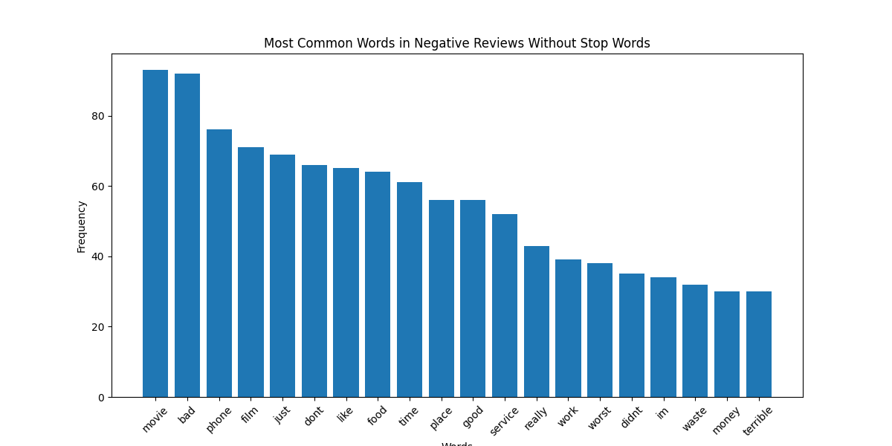
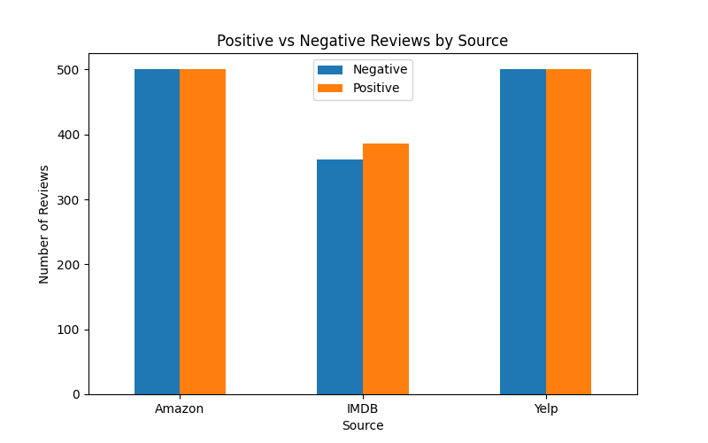
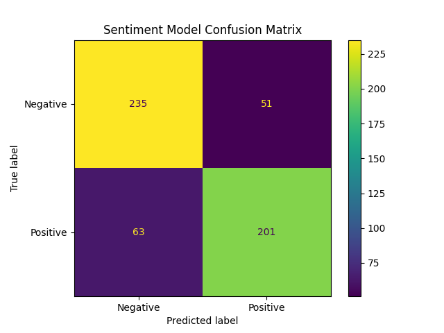

# Customer Review Sentiment Analysis Using Python

## Overview
This project analyzes customer reviews from Amazon, Yelp, and IMDB using Python, Natural Language Processing (NLP), and machine learning.

The goal of this project is to identify customer sentiment patterns, visualize negative review trends, and build a machine learning model capable of predicting review sentiment.

---

## Tools and Technologies
- Python
- pandas
- matplotlib
- scikit-learn
- Jupyter Notebook

---

## Project Features
- Data cleaning and preprocessing
- Text normalization
- Stop word removal
- Sentiment analysis
- Data visualization
- Machine learning sentiment prediction
- Model evaluation with confusion matrix and classification report

---

## Dataset
Dataset used:
UCI Sentiment Labelled Sentences Dataset

Sources included:
- Amazon Reviews
- Yelp Reviews
- IMDB Reviews

---

## Key Insights
- Common negative review words included "bad", "worst", and "disappointing".
- Yelp reviews showed a higher amount of negative feedback compared to other sources.
- Text preprocessing improved analysis quality.
- The machine learning model achieved strong sentiment prediction accuracy.

---

## Project Structure

customer-review-sentiment-analysis
│
├── data
├── images
├── notebook
│ └── customer_review_sentiment_analysis.ipynb
├── README.md
└── requirements.txt

---

## Sample Visualizations

### Negative Review Word Frequency

### Sentiment by Source

### Confusion Matrix

---

## Future Improvements
- Add advanced NLP preprocessing
- Test additional machine learning models
- Deploy as a web application
- Add real-time sentiment prediction